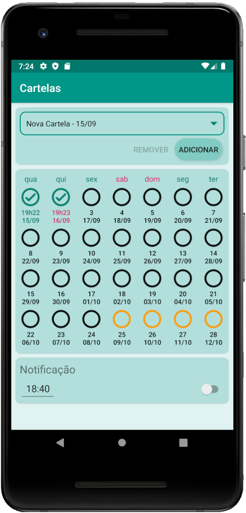

# Pill
App para acompanhar cartela de pílulas anti-concepcionais

- Cria e acompanha cartelas com nomes customizáveis
- Manda notificações em horário especificado pelo usuário - persistente em reboots
- Notificação só pode ser removida confirmando ter tomado a pílula referente ao dia na tela principal do aplicativo
- Guarda o horário que foi tomada, e aponta se foi dentro de dada tolerancia do horário esperado (antes da meia noite)

